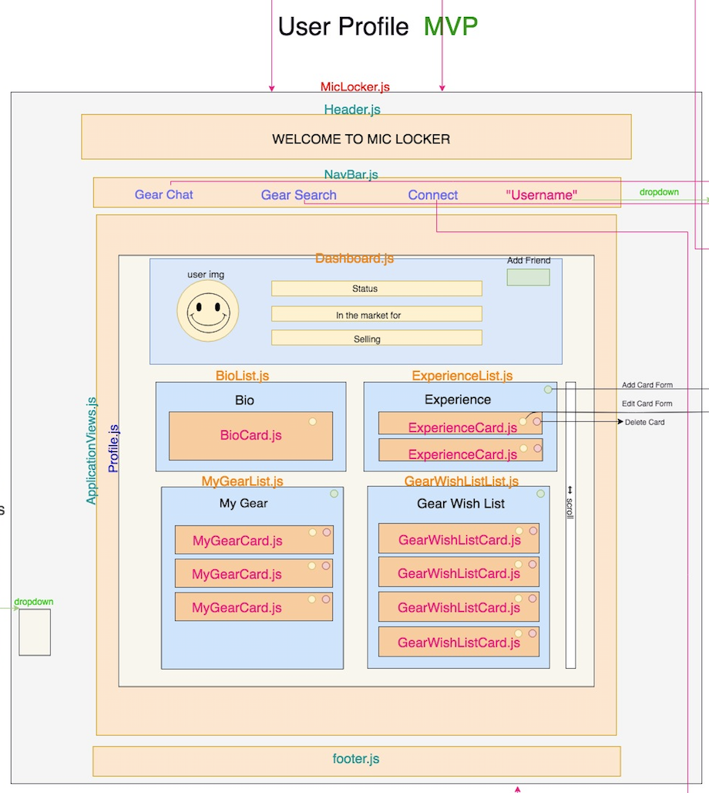
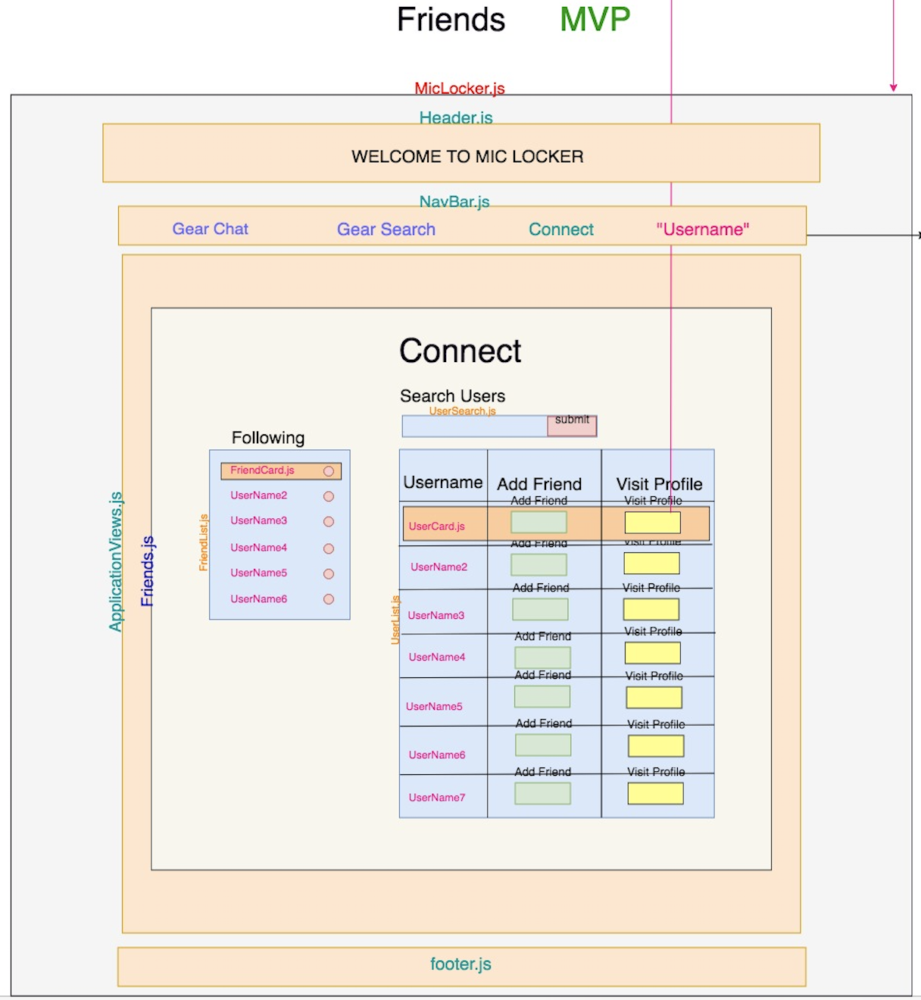

# NSS Front End Capstone: "Mic Locker"

### Specs:

I created a single page application that utilzies the following:

1. JavaScript
2. React.js
3. Firebase Authentication and Storage

### Technologies Used:

1. HTML5, CSS, JavaScript, Git, npm,
2. [React 16.8.6](https://reactjs.org/docs/getting-started.html): Core app functionality
3. [Firebase 6.1.1](https://firebase.google.com/docs): Authentication for login and Storage for file uploads
4. [Semantic UI React](https://react.semantic-ui.com/): Styling library used throughout the application
5. [JSON Server](https://github.com/typicode/json-server): Fake REST API to run mock back end server

### Final Result:

**"Mic Locker" is an organizational application for collectors of musical and professional audio equipment featuring social aspects for user connectivity**

> Users may register an account and upload a personal profile image upon registering which is stored in Firebase

> Users may personalize their profiles with a bio section and write about personal musical experiences which can be edited or deleted directly from the logged in users profile.

> Users may add gear to their Gear List and keep track of their collections with details and images. Users may also add gear to their Wish List and keep track of it similarly to their gear list.

> Users may navigate to the friends page where they will be provided with two columns of lists. On the right column is a list of all active users of Mic Locker. It displays usernames and user emails. The logged in user may filter through the users via a search bar to find specific profiles. Logged in users can navigate to other users profiles, or follow users. Followed users will populate in the left column. Users can decide to unfollow currently followed users.

### Entity Relationship Diagram of the database I created:

### Original mockup concepts for Mic Locker

#### Login Page

#### Register Page

#### Profile Page

#### Followers Page

### How to run application:
